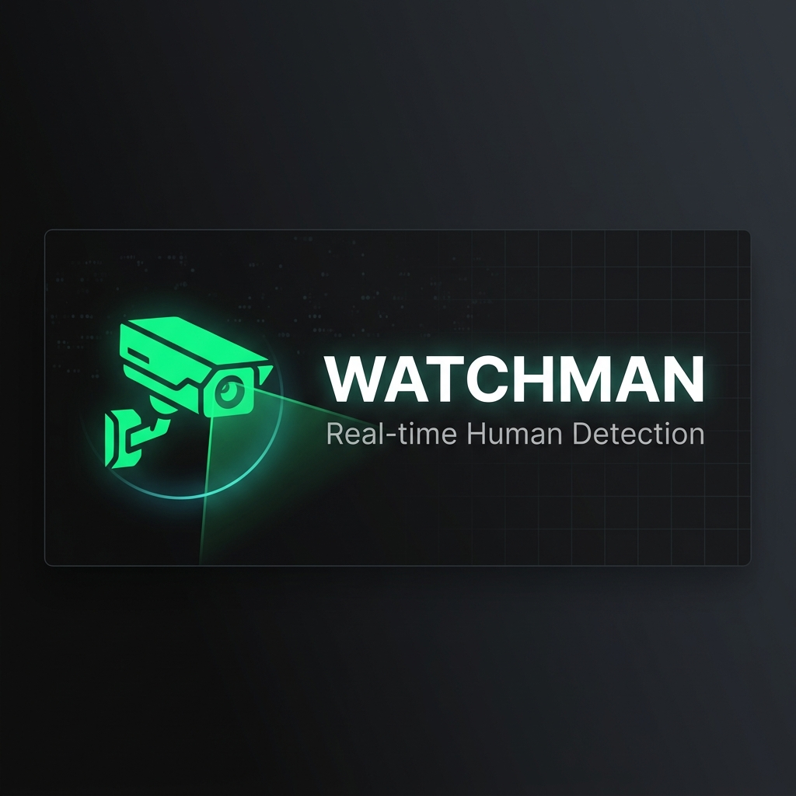

<p align="center">
  
</p>

<h1 align="center">Watchman</h1>
<p align="center">
  <strong>Real-time human detection using your Android phone as a CCTV camera.</strong>
</p>

<p align="center">
  
  
  
  
</p>

---

Watchman turns any Android phone into a real-time security camera with AI-powered human detection. It reads an MJPEG video stream from the [IP Webcam](https://play.google.com/store/apps/details?id=com.pas.webcam) app, runs YOLOv8 inference on each frame, and sends instant desktop notifications when a person is detected — all at zero hardware cost.

## ✨ Features

| Feature | Details |
|---|---|
| **Human Detection** | YOLOv8n model, filtered to `person` class only |
| **Real-time Display** | Bounding boxes, FPS counter, human count, status overlay |
| **Desktop Alerts** | Native Windows toast notifications with 10-second cooldown |
| **Low Latency** | Threaded frame grabber ensures you always see the latest frame |
| **Auto-Reconnect** | Graceful recovery on stream disconnects (5 retries) |
| **Zero Cost** | Uses your existing Android phone — no IP cameras needed |

## 🏗️ Architecture

```
┌─────────────┐     MJPEG Stream      ┌──────────────────────────────────┐
│  Android     │ ──────────────────▶  │  Watchman (Python)               │
│  IP Webcam   │  http://<ip>:8080    │                                  │
│  (Camera)    │      /video          │  ┌──────────┐   ┌────────────┐  │
└─────────────┘                       │  │ Frame    │──▶│ YOLOv8n    │  │
                                      │  │ Grabber  │   │ Inference  │  │
                                      │  │ (Thread) │   │ (GPU/CPU)  │  │
                                      │  └──────────┘   └─────┬──────┘  │
                                      │                       │         │
                                      │  ┌──────────┐   ┌────▼───────┐ │
                                      │  │ Desktop  │◀──│ Display +  │ │
                                      │  │ Notifs   │   │ HUD Overlay│ │
                                      │  └──────────┘   └────────────┘ │
                                      └──────────────────────────────────┘
```

## 📦 Requirements

- **Python** 3.9+
- **Android phone** with [IP Webcam](https://play.google.com/store/apps/details?id=com.pas.webcam) installed
- Both devices on the **same Wi-Fi network** (or USB tethering / mobile hotspot)

## 🚀 Quick Start

### 1. Clone the repo

```bash
git clone https://github.com/geeky-rish/watchman.git
cd watchman
```

### 2. Install dependencies

```bash
pip install -r requirement.txt
```

This installs:
| Package | Purpose |
|---|---|
| `opencv-python` | Video capture & display |
| `ultralytics` | YOLOv8 model & inference |
| `numpy` | Array operations |
| `winotify` | Windows 10/11 native toast notifications |

> **Note:** YOLOv8n weights (`yolov8n.pt`) are downloaded automatically on first run (~6.5 MB).

### 3. Set up IP Webcam

1. Install [IP Webcam](https://play.google.com/store/apps/details?id=com.pas.webcam) on your Android phone
2. Open the app → scroll down → tap **"Start server"**
3. Note the IP address shown (e.g., `http://192.168.1.100:8080`)

### 4. Configure & Run

Edit the stream URL in `main.py` (line 13):

```python
STREAM_URL = "http://<your_phone_ip>:8080/video"
```

Then run:

```bash
python main.py
```

Press **`q`** to quit.

## ⚙️ Configuration

All settings are at the top of `main.py`:

```python
STREAM_URL            = "http://192.168.137.170:8080/video"  # Your phone's IP
CONF_THRESHOLD        = 0.45    # Detection confidence (0.4–0.5 recommended)
INFERENCE_WIDTH       = 640     # Resize width for YOLO (lower = faster)
DISPLAY_WIDTH         = 960     # Display window width (lower = faster)
SKIP_FRAMES           = 2       # Run YOLO every N frames (1 = every frame)
NOTIFICATION_COOLDOWN = 10      # Seconds between notifications
MAX_RECONNECT_TRIES   = 5       # Reconnect attempts on disconnect
RECONNECT_DELAY       = 3       # Seconds between reconnect attempts
```

### Performance Tuning

| Want | Do |
|---|---|
| **Higher FPS** | Decrease `INFERENCE_WIDTH` to `416` or increase `SKIP_FRAMES` to `3` |
| **Better accuracy** | Increase `INFERENCE_WIDTH` to `640`, set `SKIP_FRAMES = 1` |
| **Fewer false positives** | Increase `CONF_THRESHOLD` to `0.5` or `0.6` |
| **Faster display** | Decrease `DISPLAY_WIDTH` to `640` |

## 🖥️ HUD Overview

```
┌──────────────────────────────────────────────────────┐
│ FPS: 28.3   Humans: 2   HUMAN DETECTED               │ ← Status bar
│                                                       │
│    ┌─────────────┐       ┌──────────────┐            │
│    │ Person 87%  │       │ Person 72%   │            │
│    │             │       │              │            │ ← Bounding boxes
│    │             │       │              │            │
│    └─────────────┘       └──────────────┘            │
│                                                       │
│         ALERT: 2 PERSON(S) DETECTED                   │ ← Alert banner
└──────────────────────────────────────────────────────┘
```

## 🔔 Notifications

Watchman sends native desktop notifications when humans are detected:

- **Windows 10/11**: Uses `winotify` for native toast notifications
- **Fallback**: `plyer` library (cross-platform)
- **Cooldown**: 10-second minimum gap between notifications to prevent spam
- **Console**: Alerts are always printed to the terminal regardless of notification library

## 🛠️ Troubleshooting

| Issue | Solution |
|---|---|
| `Cannot open stream` | Ensure IP Webcam is running and both devices are on the same network |
| High latency / delay | Already handled by the threaded frame grabber. Try lowering `DISPLAY_WIDTH` |
| `overread` warnings | Normal MJPEG decode warnings from OpenCV — safe to ignore |
| Low FPS | Reduce `INFERENCE_WIDTH` to `416`, increase `SKIP_FRAMES` |
| No notifications | Install `winotify` (`pip install winotify`) or check Windows notification settings |
| Model download fails | Manually download `yolov8n.pt` from [Ultralytics](https://github.com/ultralytics/assets/releases) and place in project root |

## 📁 Project Structure

```
watchman/
├── main.py              # Complete detection pipeline (single file)
├── requirement.txt      # Python dependencies
├── yolov8n.pt           # YOLOv8 nano weights (auto-downloaded)
├── assets/
│   └── banner.png       # README banner
├── .gitignore
└── README.md
```

## 📄 License

MIT — do whatever you want with it.

---

<p align="center">
  Built by <a href="https://github.com/geeky-rish">Rishi Kulkarni</a>
</p>
